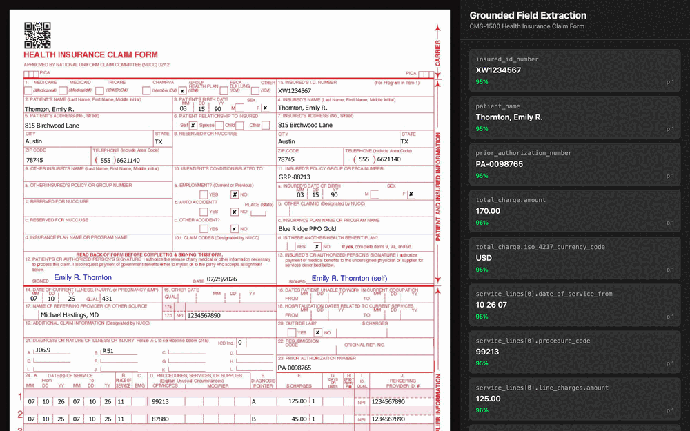
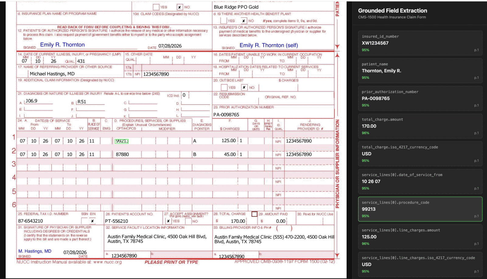
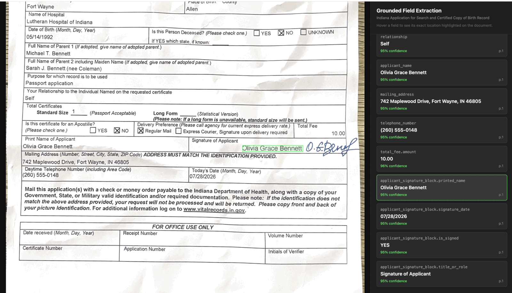
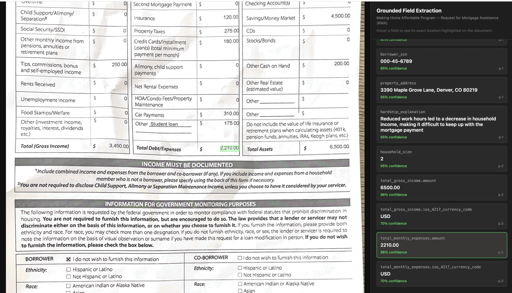
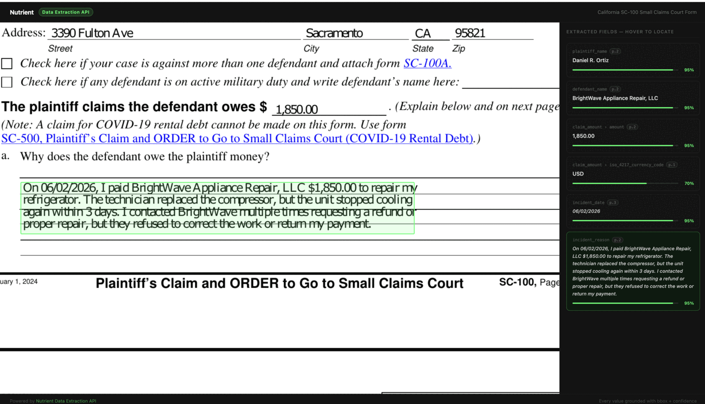
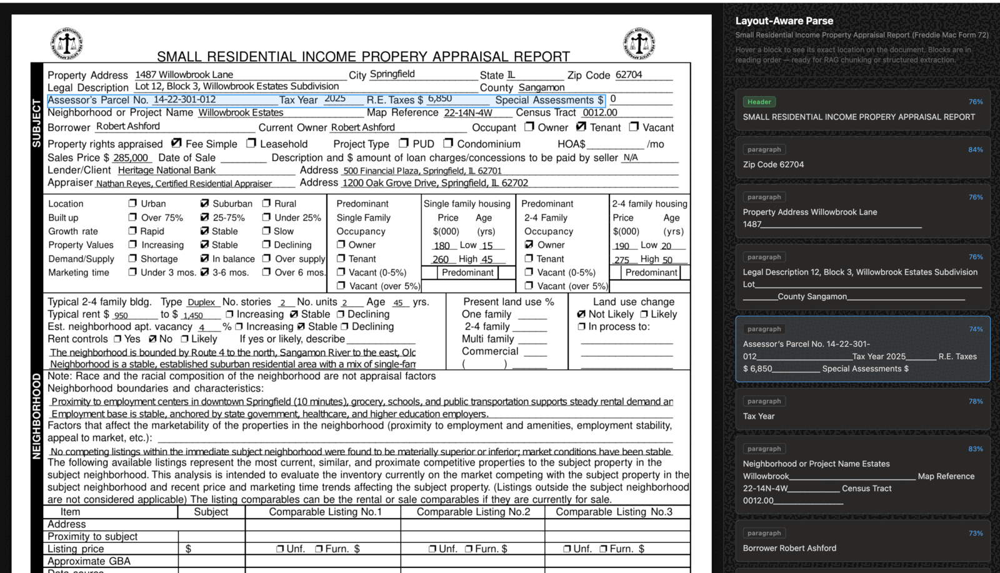

<h1 align="center">Nutrient Extraction Samples</h1>

<p align="center">
  <strong>Most document AI returns values.<br>This returns values <em>and proof</em>.</strong>
</p>

<p align="center">
  <a href="LICENSE"></a>
  
  
  <a href="https://www.nutrient.io/guides/dws-data-extraction/getting-started/"></a>
</p>

<p align="center">
  
</p>

<p align="center"><em>Hover any extracted field. The highlight lands on the exact pixels it came from.</em></p>

Every extracted value carries a **bounding box**, a **confidence score**, and a **page index**. When a value looks wrong you don't go hunting through the document — you hover the field and see precisely where the model looked. A highlight in the wrong place is a visible audit trail.

```jsonc
// Send a schema. Get back values with provenance.
"procedure_code": "99213",                                   // the value
"bbox": { "x": 412, "y": 288, "width": 74, "height": 18 },   // where it came from
"confidence": 0.95,                                          // how sure the model was
"pageIndex": 0                                               // which page
```

<p align="center">
  <a href="https://pspdfkit.github.io/nutrient-extraction-samples/demos/grounded_extraction/output/index.html"><strong>Open a live demo →</strong></a>
  &nbsp;·&nbsp;
  <a href="#run-it-yourself"><strong>Run it yourself</strong></a>
  &nbsp;·&nbsp;
  <a href="#install-the-agent-skill"><strong>Give it to an agent</strong></a>
</p>

---

## Five documents, five hard problems

Each demo is a Python script that calls the API and generates a self-contained HTML file. The generated output is committed — open any of them in a browser with no signup, no key, and no install.

<table>
<tr>
<td width="50%" valign="top">

### CMS-1500 Health Insurance Claim
`demos/grounded_extraction/` · Data Extraction

Table row extraction across a dense printed grid. The form uses a dropout-red ink grid that scanners typically destroy — procedure codes, diagnosis codes, billing amounts, and provider fields come back correct, each highlighted in the exact table cell it came from.

**[Open demo →](https://pspdfkit.github.io/nutrient-extraction-samples/demos/grounded_extraction/output/index.html)**

</td>
<td width="50%" valign="top">

### Indiana State Birth Record
`demos/birth_record_extraction/` · Data Extraction

Signature block detection on a mixed handwritten/printed document. The schema separates the *printed name* from the adjacent *cursive signature* — two visually adjacent fields that trip up most models. Includes a before/after tuning comparison showing how schema description specificity fixes extraction errors.

**[Open demo →](https://pspdfkit.github.io/nutrient-extraction-samples/demos/birth_record_extraction/output/index.html)**

</td>
</tr>
<tr>
<td width="50%" valign="top">

### Making Home Affordable — RMA
`demos/rma_extraction/` · Data Extraction

Value isolation in a dense 3-column financial table. Monthly Income, Total Assets, and Total Expenses sit side by side with nearly identical labels. The tuning story shows a vague schema description pulling the wrong column, and a precise one fixing it — with the highlight visually confirming the correction.

**[Open demo →](https://pspdfkit.github.io/nutrient-extraction-samples/demos/rma_extraction/output/index.html)**

</td>
<td width="50%" valign="top">

### CA SC-100 Small Claims
`demos/sc100_extraction/` · Data Extraction

Full narrative extraction from a free-text legal field. `incident_reason` captures a complete multi-sentence plaintiff explanation across multiple lines, grounded with a single box covering the whole area. Also shows cross-page extraction: five fields from three different pages.

**[Open demo →](https://pspdfkit.github.io/nutrient-extraction-samples/demos/sc100_extraction/output/index.html)**

</td>
</tr>
<tr>
<td colspan="2" valign="top">

### Small Residential Income Property Appraisal Report
`demos/parse_citations/` · Parse API

The document decomposed into semantic blocks — paragraphs, section headers, tables — each with spatial coordinates. This is the RAG citation case: every block in the sidebar links back to its exact location, so a retrieval pipeline can cite its source precisely. Reach for Parse when you need structure-aware chunking rather than field-level extraction.

**[Open demo →](https://pspdfkit.github.io/nutrient-extraction-samples/demos/parse_citations/output/index.html)**

</td>
</tr>
</table>

| Vertical | Demo |
|---|---|
| Healthcare billing | CMS-1500 |
| Government / vital records | Indiana Birth Record |
| Mortgage / housing assistance | Making Home Affordable RMA |
| Legal / civil court | CA SC-100 Small Claims |
| Real estate / lending | Appraisal Report (Form 72) |

<details>
<summary><strong>Screenshots</strong> — the hover interaction in each demo</summary>







</details>

---

<h2 id="run-it-yourself">Run it yourself</h2>

Just want to look? Every `output/index.html` is committed — open one in a browser and you're done. To regenerate against your own documents:

```bash
# 1. Poppler first. pdf2image shells out to it, and the failure lands
#    AFTER the API call has already been billed.
brew install poppler                  # macOS
apt-get install poppler-utils         # Debian/Ubuntu

# 2. Python 3.10+
pip install -r requirements.txt

# 3. Your Data Extraction key (separate from the Processor API key)
export NUTRIENT_API_KEY=your_key

# 4. Drop your PDF in data/, point docs.json at it, run
cd demos/grounded_extraction
python3 generate_demo.py
open output/index.html
```

Every demo folder is the same four files:

```
demo_name/
├── docs.json          # extraction schema (or parse config)
├── generate_demo.py   # calls the API, writes the HTML
├── template.html      # visual layout
└── README.md          # demo notes and tuning story
```

**Getting a key.** Data Extraction uses a **separate product key from the Processor API key**. Sign up, open the dashboard, or try the playground on the [Data Extraction API page](https://www.nutrient.io/api/data-extraction-api/). The Parse demo needs `NUTRIENT_API_KEY` set even when it replays its saved result.

Prefer to try before writing code? Test documents visually in [Nutrient Studio](https://dashboard.nutrient.io/data-extraction-api/studio/extract).

---

## What a run costs

Parse credits are charged by mode and page. **Extract requests add 6 credits per page on top of the Parse rate**, so an `agentic` extraction costs 24 credits per page.

| Mode | Parse credits per page |
|---|---:|
| `text` | 1 |
| `structure` | 1.5 |
| `understand` | 9 |
| `agentic` | 18 |

All five demos use `agentic` mode.

| Demo | Pages | Normal run | If run live |
|---|---:|---:|---:|
| CMS-1500 | 1 | 24 | 24 |
| Indiana Birth Record | 1 | 24 | 24 |
| Request for Modification | 4 | 96 | 96 |
| CA SC-100 | 4 | 96 | 96 |
| **Extraction subtotal** | **10** | **240** | **240** |
| Appraisal Report (Parse) | 4 | 0 (replays saved result) | 72 |
| **Total** | **14** | **240** | **312** |

The four extraction generators don't replay the committed cache files, so they call the API and **re-spend 240 credits on every full run**. The Parse demo replays `demos/parse_citations/data/appraisal_report_parse_results.json` while that file is present, and calls the API only when it's missing — its saved sidecar records the cost of a live four-page `agentic` Parse request as 72.

The free tier includes 5,000 credits per month, enough for about **20 full runs**.

---

## Privacy and PII before you commit

Extraction lifts document values into every derivative, so review more than the PDFs. Before committing a document swap, check:

- `demos/*/data/*.pdf` — public-source or synthetic only
- `demos/*/output/metadata.json` — document values, and API usage fields
- `demos/parse_citations/data/*_parse_results.json` — document text
- `demos/*/cache/*.json` — the full `output` payload
- `demos/*/output/index.html` — rendered field values

Two things to know about what is already committed here:

**An SSN-formatted value.** `000-45-6789` appears in `rma_extraction`'s `metadata.json`, `cache/*.json`, and `output/index.html`. The SSA never issues SSNs with a `000` prefix, so it reads as synthetic — confirm that before publishing. The RMA schema requests `borrower_ssn`, so a filled source form would commit a real one.

**The metadata files don't all have the same shape.** `birth_record_extraction`, `grounded_extraction`, and `rma_extraction` contain full API responses including account usage and billing fields; `sc100_extraction` contains derived display-card data only. Review the three full-response files before making the repository public.

Full pre-publication procedure: [`docs/launch-checklist.md`](docs/launch-checklist.md).

---

<h2 id="install-the-agent-skill">Install the agent skill</h2>

Agents can call the Data Extraction API directly through the `document-extraction-api` skill in [`PSPDFKit-labs/nutrient-skills`](https://github.com/PSPDFKit-labs/nutrient-skills), verified at revision `3da3211` (PR #27, merged 2026-07-23):

```bash
npx skills add pspdfkit-labs/nutrient-skills --skill document-extraction-api
```

The skill bundles a schema-driven extract script with per-field citations and a cost preflight, plus reference docs on schema design and reading citation output. Reach for the skill when an agent should run extractions itself; reach for these demos when a human wants to see grounded extraction with its highlights.

The pin is deliberate: install resolves against upstream `main`, so record the revision you verified and re-review before moving it.

---

## API reference

- [Data Extraction API docs](https://www.nutrient.io/guides/dws-data-extraction/getting-started/)
- [Parse API docs](https://www.nutrient.io/guides/dws-data-extraction/getting-started/)
- [API reference](https://www.nutrient.io/api/reference/data-extraction/public/#description/introduction)
- [Nutrient Studio](https://dashboard.nutrient.io/data-extraction-api/studio/extract) — test documents visually before writing code

## Contributing

To suggest a new document type, open an issue with the document name and the fields to extract. To add one yourself, copy an existing demo folder, swap the PDF and `docs.json`, and run the generator — then run the PII review above before committing.

Shared helpers live in `common/` (cache, escaping, rendering). They are landed and tested but **not yet wired into any demo generator**; that is a future migration PR, not current demo behavior.

## License

MIT — see [LICENSE](LICENSE).
